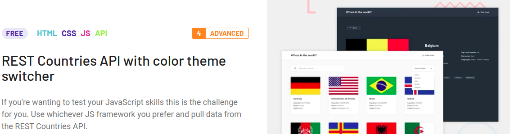

## Description

Test task using Typescript, React.js, TanStack Query and Chakra UI Components library.

## Task Description

Integrating with the [REST Countries API](https://restcountries.com/) to pull country data and display it like in the designs.


I found the idea for this challenge on the resource [frontendmentor](https://www.frontendmentor.io/challenges/rest-countries-api-with-color-theme-switcher-5cacc469fec04111f7b848ca)

## Demo URL
[Countries-app](https://berezin787.github.io/countries-spa/)

## Installation

```bash
$ npm install
```
## Running the app

```bash
$ npm run dev
```
